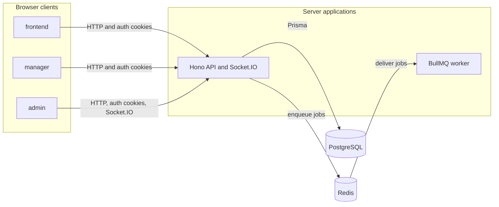

# Competition Manager

Competition Manager is a multi-tenant web application for organizing athletics competitions, accepting athlete registrations, and publishing results. This repository is under active development. It currently provides the account, Organization, deployment, and background-job foundations; most competition, registration, payment, and result workflows described in the domain documents are planned rather than implemented.

The monorepo uses [Bun](https://bun.sh/) and [Turborepo](https://turbo.build/repo). All applications and packages are TypeScript.

## Current implementation

- The public frontend supports email/password sign-up, sign-in, and API health display.
- The Organization manager requires a signed-in, email-verified User with at least one Organization Membership. Owners and Organization Staff can create resumable Competition Drafts, configure their Venue, contact, registration schedule, pricing, Events, eligibility, Rounds, and Start Groups, then publish a complete Competition.
- The platform-admin application manages Users and Organizations, previews and queues LRBA Athlete Directory Imports, and embeds Prisma Studio for authorized database access.
- The PostgreSQL schema models the Competition, athlete, registration, pricing, result, interchange, payment, settlement, and audit domains. Competition setup and publication are implemented; registration, payment, result, and interchange workflows remain planned.
- The API provides Better Auth endpoints, platform-admin Organization endpoints, health and Prometheus endpoints, and a Socket.IO endpoint that reads Better Auth sessions.
- The API and worker share a Redis-backed BullMQ contract for the `api.started` delivery check and confirmed LRBA Athlete Directory Imports.

See [CONTEXT.md](./CONTEXT.md) for the planned domain language and [the architectural decision records](./docs/adr/) for accepted product and architecture decisions.

## Repository layout

### Applications

| Path            | Package name | Responsibility                                                 |
| --------------- | ------------ | -------------------------------------------------------------- |
| `apps/api`      | `api`        | Hono API, Better Auth, Prisma, metrics, logging, and Socket.IO |
| `apps/frontend` | `frontend`   | Public and registrant React application                        |
| `apps/manager`  | `manager`    | Organization manager React application                         |
| `apps/admin`    | `admin`      | Platform-administration React application                      |
| `apps/worker`   | `worker`     | BullMQ background-job consumer                                 |

### Shared packages and tests

| Path                         | Package name              | Responsibility                                                                |
| ---------------------------- | ------------------------- | ----------------------------------------------------------------------------- |
| `packages/jobs`              | `@repo/jobs`              | Queue names, typed job payloads, and BullMQ adapters                          |
| `packages/utils`             | `@repo/utils`             | Shared Prisma-derived contracts, utilities, auth routing, and Socket.IO types |
| `packages/ui`                | `@repo/ui`                | Reusable React components, styles, and locale resources                       |
| `packages/typescript-config` | `@repo/typescript-config` | Shared TypeScript configuration                                               |
| `tests/e2e`                  | `e2e`                     | Playwright tests against the Docker-based application stack                   |

## Architecture



The API listens on `API_PORT`, which defaults to `3000`. The three React applications run on separate Vite development servers. Socket.IO shares the API HTTP server and accepts configured frontend and admin origins.

## Prerequisites

- Bun 1.4.2, as declared by `packageManager` in `package.json`
- Docker with Docker Compose for PostgreSQL, Redis, integration tests, and end-to-end tests

## Local development

Install dependencies:

```bash
bun install --frozen-lockfile
```

Generate the ignored Varlock types, Prisma client, and shared Prisma-derived Zod model schemas. Run these commands after every clean checkout and whenever their schemas change:

```bash
bun run env:generate
bun run prisma:generate
```

Start PostgreSQL and Redis:

```bash
bun run docker:db
```

This uses [docker-compose.db.yml](./docker-compose.db.yml). Stop the services with `bun run docker:db:down`.

Validate the development environment and apply local database migrations:

```bash
bun run env:validate
bun run prisma:migrate
```

Start all five applications:

```bash
bun run dev
```

Default development URLs:

| Application | URL                     |
| ----------- | ----------------------- |
| API         | `http://localhost:3000` |
| Frontend    | `http://localhost:5173` |
| Admin       | `http://localhost:5174` |
| Manager     | `http://localhost:5175` |

The health endpoint is `GET /api/health`; Prometheus metrics are available at `GET /metrics`.

## Verification and tests

Build shared packages and applications before running checks that consume emitted types:

```bash
bun run build
bun run check
bun run test
```

`bun run check` validates formatting, lint rules, and TypeScript through the configured Oxlint type-aware checks.

Run the Redis-backed BullMQ integration tests while the development Redis service is running:

```bash
REDIS_URL=redis://127.0.0.1:6379/15 bun run test:integration
```

Set `ATHLETE_IMPORT_TEST_DATABASE_URL` to a dedicated, migrated PostgreSQL test database to include
the worker's destructive create-and-update import integration test. Never point it at a development
or production database.

Run the Playwright end-to-end suite:

```bash
bun run e2e
```

The end-to-end command uses [docker-compose.e2e.yml](./docker-compose.e2e.yml) to build and start PostgreSQL, Redis, the API, the worker, and all three web applications. Its PostgreSQL and Redis services do not publish host ports, so they can coexist with the development infrastructure. The application ports `3000`, `5173`, `5174`, and `5175` must still be available.

CI performs clean-checkout generation, validates both Compose files, validates Prisma and Varlock, builds the monorepo, runs `bun run check`, and runs unit, integration, and end-to-end tests.

## Environment variables

[Varlock](https://varlock.dev/) schemas are the configuration source of truth. Change the relevant schema, then run `bun run env:generate`; do not edit generated `env.d.ts` files.

| File                                                     | Variables and purpose                                                            |
| -------------------------------------------------------- | -------------------------------------------------------------------------------- |
| [.env.shared](./.env.shared)                             | `APP_ENV`, application ports, and derived API, frontend, manager, and admin URLs |
| [apps/api/.env.schema](./apps/api/.env.schema)           | `DATABASE_URL`, `REDIS_URL`, `BETTER_AUTH_SECRET`, and `LOKI_HOST`               |
| [apps/worker/.env.schema](./apps/worker/.env.schema)     | `DATABASE_URL` and `REDIS_URL`                                                   |
| [apps/frontend/.env.schema](./apps/frontend/.env.schema) | Imports the shared browser configuration                                         |
| [apps/manager/.env.schema](./apps/manager/.env.schema)   | Imports the shared browser configuration                                         |
| [apps/admin/.env.schema](./apps/admin/.env.schema)       | Imports the shared browser configuration                                         |

Development and test defaults live in the schemas. Staging and production deployments must provide `MY_APP_API_URL`, `MY_APP_FRONTEND_URL`, `MY_APP_MANAGER_URL`, and `MY_APP_ADMIN_URL`. The API also requires its database, Redis, Better Auth secret, and Loki values; the worker requires the same PostgreSQL database and Redis.

Keep secrets and local overrides out of version control.

## Accounts and access

Authentication currently uses email and password only. Google sign-in is planned, but no social provider is configured.

- The public frontend allows account creation with a name, email address, and password.
- The manager has no public sign-up. A User needs a verified email and at least one Organization Membership. Organization Owners and members with the `staff` role can configure Competitions; ordinary members cannot mutate Competition setup.
- The admin has no public sign-up. A User needs the platform `admin` role.
- Email delivery is not configured. A platform administrator can mark an account's email as verified in the admin User editor.

After the database is migrated and the API environment is available, create the first platform administrator with:

```bash
bun --filter api add-admin -- "Admin User" admin@example.com your-secure-password
```

The script creates the account through Better Auth, assigns the `admin` role, and marks the email as verified. If the email already exists, it exits without changing that account.

Platform administrators create Organizations and assign an eligible verified User as owner. Users cannot create Organizations themselves.

## Background jobs

The API enqueues a typed `api.started` job after it starts listening. Confirmed LRBA Athlete Directory Imports enqueue an `athlete.import` job with the persisted import-batch ID. The worker applies each batch in one PostgreSQL transaction and retries it up to three times. It waits for Redis before reporting ready and closes its BullMQ worker and PostgreSQL pool on `SIGTERM` or `SIGINT`.

Platform administrators upload the established LRBA tab-separated `.csv` export from the admin Athletes page. Previewing validates the whole file and reports create and update counts without changing Athlete data. Club federation numbers and abbreviations come from the export; existing Club names and countries remain unchanged. Confirmation re-uploads and verifies the same checksum, stages normalized rows for the worker, and creates the annual November-through-October LRBA Athletics Season when needed. The source file itself is not retained.

## Deployment

See [docs/operations.md](./docs/operations.md) for logging, health, metrics, and shutdown behavior.

Deployments use GitHub Actions, Docker Hub, and [Dokploy](https://dokploy.com/). Each application has a Dockerfile under its `apps/<name>` directory.

### Staging

A push to `main`, or a manual staging workflow dispatch, runs CI and builds all five images with `APP_ENV=staging`. It pushes `:staging` and commit-SHA tags, then triggers each Dokploy staging application.

Configure `DOCKERHUB_USERNAME`, `DOCKERHUB_TOKEN`, `DOKPLOY_DOMAIN`, `DOKPLOY_API_KEY`, and `DOKPLOY_STAGING_{ADMIN,API,FRONTEND,MANAGER,WORKER}_APP_ID` as GitHub secrets.

### Production

A tag matching `admin@*`, `api@*`, `frontend@*`, `manager@*`, or `worker@*` builds and deploys that application. Production images receive `:latest` and version tags. Web applications build with `APP_ENV=production`; the API and worker read runtime values from Dokploy.

Production releases use [Changesets](https://github.com/changesets/changesets):

```bash
bun run release:prepare
bun run release:version
bun run release:push
```

Configure the same Docker Hub and Dokploy credentials as staging, plus `DOKPLOY_PROD_{ADMIN,API,FRONTEND,MANAGER,WORKER}_APP_ID`.

Workflow definitions live in [.github/workflows/staging.yml](./.github/workflows/staging.yml) and [.github/workflows/production.yml](./.github/workflows/production.yml).

## Documentation map

- [CONTEXT.md](./CONTEXT.md) defines the domain vocabulary and planned product concepts.
- [docs/adr](./docs/adr/) records accepted architecture and product decisions.
- [docs/operations.md](./docs/operations.md) covers runtime operations and log data handling.
- [AGENTS.md](./AGENTS.md) gives repository-specific guidance to coding agents.
